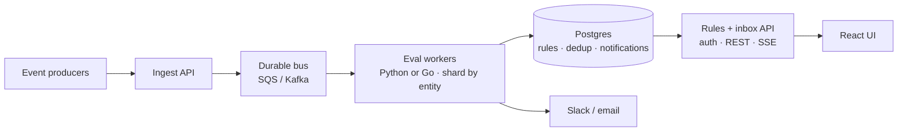

# Intraday Notifications PRD

Contact centers need timely intraday alerts when queues slip, agents go out of adherence, or calls run long, without spam on every snapshot. This MVP lets agents and team leads configure closed triggers, evaluate a live-style event stream, and see firings in an inbox.

## Goals

- Configure intraday alert rules scoped to an agent or their queues.
- Evaluate queue, agent-state, and adherence events with noise control (false→true; adherence window dedupe).
- Show firings in the notifications inbox and console stub, with enough context to trust the demo.

## Users

- **Agent**: personal adherence and long-call self-alerts (e.g. violation > 10m, call > 45m).
- **Team lead**: queue SLA, backlog, forecast vs recent volume, and long calls on owned queues.
- Not optimizing for head-of-support digests in this MVP.

## MVP scope

### In scope

- Rule CRUD via React UI + JSON API with five closed triggers: adherence duration, queue SLA breach, tickets waiting, forecast over recent volume (`volume_forecast_next_15m` ≥ user % of `volume_last_15m`), agent state duration (long call).
- Forecast comes from the event feed; this system does not build a forecasting model.
- Per-event evaluation with become-true and adherence-window dedupe (no configurable cooldown).
- Stub delivery: console log + DB inbox; notifications UI with 3s polling.
- Username stub (`created_by` / `updated_by` / `owner_id`): scopes rule CRUD and inbox (not real auth).
- Seed rules plus a ~50-minute / 96-event sample morning feed (`server/events.jsonl`).
- Demo JSONL harness (instant replay + 10-minute stream) for engineering only, not a product surface.

### Out of scope

- Real Slack, email, or push delivery.
- Auth, authorization, or multi-tenancy.
- Production deploy, CI/CD, or infra-as-code.
- Free-form rule language or drag-and-drop builder.
- Building or training a volume forecasting model.
- Head-of-support digests.
- Kafka, Redis, websockets, or multi-process deploy.
- Treating the JSONL replayer as a customer-facing product.

## Product decisions

- **Scopes**: Agents usually set `agent_id`; leads set `queue_ids`. Recipient is the logged-in user (`owner_id` = `X-Username`).
- **Noise control**: Notify on false→true, not every poll while still true; adherence once per violation window. No configurable cooldown in this MVP.
- **Dedup memory**: Prior condition/window lives in `notification_dedup`, owned by `RuleEngine`. Editing a rule clears that rule's dedup rows so the next match can fire again.
- **Closed triggers**: Five typed evaluators instead of a free-form rule language. Easier to review, test, and build UI for.
- **Username stub**: `X-Username` stamps creator/updater/owner, scopes rule CRUD and inbox. Eval still loads all enabled rules.
- **Delivery stub**: Console + inbox behind `NotificationChannel`. MVP prints then saves. Real Slack would use a transactional outbox (persist first, at-least-once send with an idempotency key). `notification_dedup` is evaluate-side noise control, not delivery idempotency.

## Tradeoffs

- **Python stack**: FastAPI + Pydantic + SQLAlchemy keeps API validation and OpenAPI→TypeScript one pipeline. This demo is I/O-bound (HTTP + SQLite + cheap rule checks), so Python is fine. Revisit Go only if profiling shows CPU-bound eval.
- **Single process**: One FastAPI app owns rules, evaluate, notify, and ingest. Dedup lives in `notification_dedup` (not the request session), so become-true still works across events. The real limit is blast radius / scaling ingest vs CRUD, not session lifetime.
- **No Kafka/SQS in MVP**: Events come from `POST /events` or in-process replay. A durable bus is for retry/backpressure later, not needed for the demo volume.
- **SQLite file DB**: Zero setup (`server/data/assembled.db`). Fine for one writer + light reads. Production would use Postgres.
- **3s polling for notifications**: Good enough for the demo inbox. Prefer SSE later over websockets unless the client must push upstream.
- **Closed trigger set**: Five typed evaluators instead of a free-form rule language. Easier to validate, build UI for, and test.

- **Username header stub**: `X-Username` is creator, owner/recipient, and inbox scope. Not real auth.
- **OpenAPI-generated client**: Spec → `client/src/api-client/`. Demo roster from `GET /demo/roster`. Trigger form flags from `server/lib/trigger_field_config.py`; labels stay hand-written.

## What I'd do with more time

- Conduct UAT with end users (agents and team leads) and have QA thoroughly test the product paths (rule CRUD, replay/stream story beats, inbox scoping).
- Move to Postgres. Measure ingest under load before redesigning the stack (e.g. Go workers, Kafka) on a guess.
- Split ingest/eval from the CRUD API if write contention shows up (still Python first).
- Real Slack/email (out of scope for MVP). Add adapters behind `NotificationChannel` without changing evaluate. Delivery follows the outbox path above.
- Real auth replacing `X-Username` (out of scope for MVP).
- Optional per-rule cooldown if recover→breach flapping becomes an ops issue.
- SSE push for the inbox; drop 3s polling. Websockets only if we need client→server realtime.
- Message bus (e.g. SQS/Kafka) for fault tolerance: if a process dies mid-evaluate, an in-flight `POST /events` snapshot can be lost; a durable queue lets consumers retry until ack. Also useful when producers need buffering/replay independent of the API process.
- If profiling shows CPU-bound eval at real volume: multi-process Python workers and/or a dedicated stream worker (Go is an option here), sharded by entity.

### Ideal system design (post-MVP)

MVP today is one FastAPI process + SQLite + polling. Direction below: durable ingest, separate CRUD vs eval, shared Postgres, push to the UI.

**Event path:** producers → ingest → bus (retry until ack) → workers → Postgres + Slack/email.

## Success criteria for the demo

- Configure a rule in the UI with a username set.
- Replay or stream the sample feed; correct notifications for seed story beats (SLA breach, backlog, adherence, long call).
- Each notification is traceable via `rule_id` and the triggering event context.

## Assumptions

- Single-tenant demo; no auth beyond the username header stub.
- Event feed is JSONL locally; production would POST events to `/events` or a bus consumer.
- SQLite file DB is acceptable for concurrent demo load (brief locks under stream + API reads).
- Seed rules and sample events encode a coherent “morning shift” narrative for reviewers.
- Reviewers run server and client locally; no hosted environment is provided.
