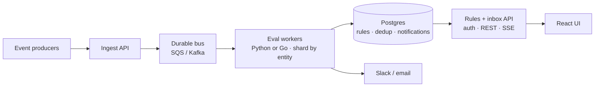

# Intraday Notifications — PRD

Contact-center ops need timely intraday alerts when queues slip, agents go out of adherence, or calls run long — without the noise of repeated firings on every snapshot. This MVP lets agents and team leads configure closed trigger types, evaluates a live-style event stream, and surfaces firings in an inbox with enough traceability to trust the demo.

## Goals

- Let agents and team leads configure intraday alert rules scoped to themselves or their queues.
- Evaluate incoming queue, agent-state, and adherence events with noise control (notify when a condition becomes true; adherence-window dedupe).
- Make firings visible and traceable via the notifications inbox and console delivery stub.

## Users

- **Agent** — personal adherence and long-call self-alerts (e.g. “my adherence violation > 10m”, “my call > 45m”).
- **Team lead** — queue SLA breaches, backlog thresholds, forecast above recent volume, and long calls on owned queues.
- Not optimizing for head-of-support digests in this MVP.

## MVP scope

### In scope

- Rule configuration via React UI + JSON API with five closed triggers: adherence violation duration, queue SLA breach, tickets waiting, forecast over recent volume (`volume_forecast_next_15m` ≥ user-set % of `volume_last_15m`), agent state duration (long call).
- Forecast alerts consume `volume_forecast_next_15m` already present on each `queue_snapshot` — no forecasting model in this system.
- Per-event evaluation with become-true checks and adherence-window dedupe (no configurable cooldown).
- Stub delivery: console log + DB inbox; notifications UI with 3s polling.
- Username stub for `created_by` / `updated_by` / `owner_id` (recipient): scopes rule CRUD and inbox to the logged-in user (not real auth).
- Seed rules plus a ~90-minute / ~100-event sample morning feed.
- Demo JSONL harness (instant replay + 10-minute stream) as an engineering aid, not a product surface.

### Out of scope

- Real Slack, email, or push delivery.
- Authentication, authorization, or multi-tenancy.
- Production deploy, CI/CD, or infra-as-code.
- Free-form rule DSL or drag-and-drop builder.
- Building or training a volume forecasting model (forecast is an upstream input on events).
- Head-of-support digests.
- Kafka, Redis, websockets, or multi-process deploy.
- Treating the JSONL replayer as a customer-facing product.

## Product decisions

- **Scopes** — Agent-oriented rules typically set `agent_id`; team-lead rules set `queue_ids`. Notification recipient is the logged-in user (`owner_id` = `X-Username`).
- **Noise control** — For snapshot-style triggers, notify when the condition becomes true, not on every later poll while it stays true. Adherence violations also dedupe within a violation window. Agent state-duration rules fire on transition events (already discrete). Configurable per-rule cooldown is an explicit non-goal for this MVP.
- **Dedup memory** — Prior condition/window lives in `notification_dedup`, owned by `RuleEngine` (not a separate service and not delivery).
- **Closed triggers** — Five typed evaluators instead of an expression language keeps the MVP reviewable, testable, and UI-friendly without building a DSL parser.
- **Username stub** — The UI sends `X-Username` on rule and notification endpoints. It stamps `created_by` / `updated_by` / `owner_id` (recipient), scopes rule CRUD to the creating user, and scopes the inbox to that same recipient. Event evaluation still loads all enabled rules. Login commits the header value.
- **Delivery stub** — Notifications persist to SQLite and print to console. External channels plug in behind the same delivery port later.

## Tradeoffs

- **Python stack** — Chose FastAPI + Pydantic + SQLAlchemy so API validation and OpenAPI→TypeScript stay one pipeline. This workload is mostly I/O (HTTP + SQLite) plus cheap rule checks; the demo (~100 events) is not language-bound. CPython’s GIL limits *in-process multi-core Python threads*, but async + multiple processes scale I/O-bound services fine. Go is stronger for dense multi-core CPU workers — relevant only if profiling later shows CPU-bound eval, not a reason to reject Python for this MVP.
- **Single process** — One FastAPI app runs rules, evaluator, notifications, and ingest. Each HTTP request uses a short DB transaction; the JSONL harness reuses a session and commits per event. Cross-snapshot memory is *not* held in that session — it lives in `notification_dedup` so become-true/window dedupe survives across events and would still work if multiple app instances shared one Postgres. The real MVP limit is blast radius / independent scaling of ingest vs CRUD, not “one session can’t see two snapshots.”
- **No Kafka/SQS in MVP** — Events enter via `POST /events` or in-process replay. Fine at demo volume; a durable bus matters when you need fault tolerance (retry a snapshot if a consumer dies mid-evaluate), backpressure, or many producers — not as a default.
- **SQLite file DB** — Zero setup for reviewers (`server/data/assembled.db`). Fine for one writer and light concurrent reads in the demo. Poor fit for multi-instance deploy or heavy concurrent writers; production would use Postgres (dedup can stay in Postgres, or Redis if it becomes hot).
- **3s polling for notifications** — Good enough to watch the inbox during replay. At larger fan-out, prefer SSE (mature, one-way HTTP event streams) over websockets unless the client must push realtime messages upstream.
- **Closed trigger set** — Five typed evaluators instead of a rule DSL. Matches the sample event types, keeps validation/UI/tests enumerable, and blocks arbitrary expressions.
- **Username header stub** — Real auth is out of scope. `X-Username` is creator, owner/recipient, and inbox scope. Not a real login system.
- **OpenAPI-generated client** — Spec at `client/src/generated/openapi.json`; typed models + `*Service` classes under `client/src/api-client/` (`openapi-typescript-codegen`). App code imports like `import { RuleRead, RulesService, TriggerType } from '@/api-client'`. Demo agents/queues come from `GET /demo/roster`. Trigger form field visibility/required flags are owned in `server/lib/trigger_field_config.py` and exported to `triggerFormConfig.generated.ts`; human labels stay hand-maintained in `triggerFormConfig.ts`.

## What I'd do with more time

- Move to Postgres; load-test ingest before assuming a rewrite.
- Split ingest/eval from the CRUD API if write contention shows up (still Python first).
- Real Slack/email (out of scope for MVP) behind `NotificationChannel` — console/inbox stubs stay; adapters plug in without changing evaluate.
- Rule dry-run (“would this have fired?”) against a fixture window.
- Real auth replacing `X-Username` (out of scope for MVP).
- Optional per-rule cooldown if recover→breach flapping becomes an ops issue.
- SSE push for the inbox; drop 3s polling. Websockets only if we need client→server realtime.
- Message bus (e.g. SQS/Kafka) for fault tolerance: if a process dies mid-evaluate, an in-flight `POST /events` snapshot can be lost; a durable queue lets consumers retry until ack. Also useful when producers need buffering/replay independent of the API process.
- If profiling shows CPU-bound eval at real volume: multi-process Python workers and/or a dedicated stream worker (Go is an option here), sharded by entity.

### Ideal system design (post-MVP)

MVP today is one FastAPI process + SQLite + polling. Direction below: durable ingest, separate CRUD vs eval, shared Postgres, push to the UI.

**Event path:** producers → ingest → bus (retry until ack) → workers → Postgres + Slack/email.

## Success criteria for the demo

- Configure a rule in the UI with a username set.
- Replay or stream the sample feed; correct notifications for seed story beats (SLA breach, backlog, adherence, long call).
- Each notification is traceable via `rule_id` and the triggering event context.

## Assumptions

- Single-tenant demo; no auth beyond the username header stub.
- Event feed is JSONL locally; production would POST events to `/events` or a bus consumer.
- SQLite file DB is acceptable for concurrent demo load (brief locks under stream + API reads).
- Seed rules and sample events encode a coherent “morning shift” narrative for reviewers.
- Reviewers run server and client locally; no hosted environment is provided.
