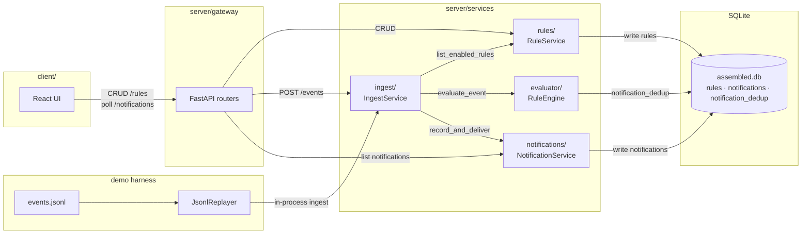

# Intraday Notification System

Intraday Notification System is a demo for contact-center operations. Agents and team leads configure alert rules over queue snapshots, agent state, and adherence events; the backend evaluates each event and notifies when a condition becomes true (not on every later poll) so alerts stay timely without spam. Product details, MVP scope, tradeoffs, and roadmap: [PRD.md](PRD.md). Layout: `server/` (FastAPI + evaluator) and `client/` (React + Vite).


## Review this repo in 10 minutes

Start with the product surface above, then follow the evaluate path — that is where the interesting logic lives:

1. **`server/services/evaluator/rule_engine.py`** — per-event orchestration: index candidates → run trigger matchers → become-true / adherence-window noise control → `NotificationCreate` payloads.
2. **`server/services/evaluator/rule_index.py`** — which enabled rules can fire for this event (type + scope).
3. **`server/services/evaluator/triggers/`** — one closed matcher per `TriggerType` (SLA, backlog, forecast-over-volume, adherence, state duration).
4. **`server/tests/evaluator/`** — `test_triggers.py`, `test_rule_engine.py`, and `test_noise_control.py` encode the rising-edge and window-dedupe story.

Skim [evaluator/README.md](server/services/evaluator/README.md) if you want the wiring diagram before diving into the files.

## Architecture



Rules are configured over HTTP; events enter via `POST /events` or the JSONL harness (same `IngestService` + DB as the API). The **evaluator** (`RuleEngine`) indexes enabled rules, runs closed trigger matchers, and remembers prior condition/window state in `notification_dedup` so snapshot feeds notify when a condition becomes true (plus adherence-window dedupe) before `NotificationService` records inbox rows (and console stubs).

## How to run

### Prerequisites

Python 3.12 (pinned in `server/.python-version` for local `uv sync`; CI uses 3.11, `requires-python >=3.11`), [uv](https://docs.astral.sh/uv/), [Bun](https://bun.sh/)

### 1. Install dependencies

```bash
cd server && uv sync
cd ../client && bun install
```

`uv sync` installs the app packages (`lib`, `rules`, `evaluator`, `notifications`, `ingest`, `gateway`) editable into the venv — no `PYTHONPATH` export needed.

### 2. Generate the TypeScript API client and trigger form config

```bash
cd server
uv run python scripts/export_openapi.py
uv run export-trigger-config
cd ../client
bun run generate:api
```

Writes `client/src/api-client/` via `openapi-typescript-codegen` (models, enums, and `*Service` classes) and `client/src/routes/rules/triggerFormConfig.generated.ts` from `server/lib/trigger_field_config.py`. App code imports from `@/api-client`, e.g. `RulesService`, `RuleRead`, `TriggerType`. Demo agents/queues are served at runtime by `GET /demo/roster` (from `lib/demo_roster.py`), not codegen’d into the client. Human trigger labels stay in `triggerFormConfig.ts`.

### 3. Seed demo rules (once per empty database)

```bash
cd server
uv run seed-rules
```

Inserts the seven built-in demo rules when the rules table is empty. Safe to re-run (no-op if rules already exist). Each seed rule’s `created_by` matches its demo persona (`a_19`, `a_42`, or `lead_billing`) so those usernames see the matching rules in the UI.

### 4. Start the API

```bash
cd server
uv run dev
```

- API: http://127.0.0.1:8000 — Swagger: `/docs`
- Equivalent long form: `uv run uvicorn gateway.main:app --reload --host 127.0.0.1 --port 8000`

### 5. Start the React UI

```bash
cd client
bun run dev
```

- UI typically http://127.0.0.1:5173
- API base defaults to `http://127.0.0.1:8000` (override with `VITE_API_BASE_URL`)
- Enter a username in the header before creating/editing rules

### 6. Replay the sample morning (instant)

```bash
cd server
uv run python -m tests.event_streamer.jsonl_replayer --events events.jsonl --mode instant
```

### 7. Stream the sample morning (10 wall-clock minutes)

```bash
cd server
uv run stream-events
```

Defaults: `events.jsonl`, stream mode, 600s wall clock. Override as needed, e.g. `uv run stream-events --stream-duration-sec 30`.

### 8. Lint and test

Server (`uv run lint` = ruff check + ruff format --check + mypy):

```bash
cd server
uv run lint
uv run pytest
```

Client (`bun run lint` = Prettier check + ESLint + `tsc --noEmit`):

```bash
cd client
bun run lint
bun test
bun run format   # Prettier --write
bun run typecheck
```

GitHub Actions (`.github/workflows/ci.yml`) runs server lint/pytest, client lint/tests, and fails if `openapi.json` or `triggerFormConfig.generated.ts` are stale.

### 9. Sync sample events fixture (optional)

Canonical feed is `server/events.jsonl`. To copy it into the test fixture:

```bash
cd server && uv run python scripts/generate_events.py
```

Note: the JSONL harness under `server/tests/event_streamer` is for demos and tests only; production-shaped ingest is `POST /events`.

## Demo walkthrough (~2–3 min)

With API + UI running and rules seeded:

1. In the UI header, set username to `lead_billing`. Open **Rules** — you should see Billing SLA, backlog ≥ 20, forecast ≥ 130% of recent volume, team adherence, and long-call rules. Open **Notifications** (empty until replay).
2. In another terminal: `cd server && uv run python -m tests.event_streamer.jsonl_replayer --events events.jsonl --mode instant` (clears prior inbox/dedup, then replays the sample morning).
3. Watch the API terminal for `[NOTIFY]` lines, then refresh/poll **Notifications** as `lead_billing` — expect SLA breach, backlog, forecast-above-recent, team adherence, and long-call firings.
4. Switch username to `a_19` — inbox shows the adherence > 10m self-alert. Switch to `a_42` — long-call self-alert.
5. Optional: create a rule as either persona (no channel/enabled pickers; delivery is always console + inbox; toggle enable/disable from the rules list).

Story beats come from seed rule ids: `rule_lead_sla_billing`, `rule_lead_tickets_billing`, `rule_lead_forecast_over_volume`, `rule_lead_adherence`, `rule_lead_long_call`, `rule_agent_adherence`, `rule_agent_long_call`.

## Scripts reference

| Where | Command | What it does |
|-------|---------|--------------|
| `server/` | `uv run dev` | API with reload on `:8000` |
| `server/` | `uv run seed-rules` | Insert demo rules if the table is empty |
| `server/` | `uv run stream-events` | Replay `events.jsonl` over ~10 wall-clock minutes |
| `server/` | `uv run lint` | Ruff check, Ruff format check, mypy |
| `server/` | `uv run pytest` | Server tests |
| `server/` | `uv run python scripts/export_openapi.py` | OpenAPI JSON for the client |
| `server/` | `uv run export-trigger-config` | Trigger form field flags → `triggerFormConfig.generated.ts` |
| `server/` | `uv run python scripts/generate_events.py` | Sync `events.jsonl` → test fixture |
| `client/` | `bun run dev` | Vite UI (usually `:5173`) |
| `client/` | `bun run build` | Typecheck + production build |
| `client/` | `bun run generate:api` | Regenerate `src/api-client/` from OpenAPI (`openapi-typescript-codegen`) |
| `client/` | `bun run lint` | Prettier check, ESLint, TypeScript |
| `client/` | `bun test` | Bun unit tests (`parseRuleForm`, etc.; `bun run test` runs Vitest) |
| `client/` | `bun run format` | Prettier write |
| `client/` | `bun run typecheck` | `tsc --noEmit` only |

## Database schema

SQLite file: `server/data/assembled.db` (created on API startup). Three tables. `notifications.rule_id` and `notification_dedup.rule_id` are foreign keys to `rules.id` with `ON DELETE CASCADE` (SQLite FK pragma enabled on connect).

If you already have an older DB (e.g. with `cooldown_sec`, `eval_state`, or `audience`), delete `server/data/assembled.db` and re-run `uv run seed-rules` (or let the API recreate an empty file on startup).

### `rules`

Configured alert rules. `owner_id` (notification recipient) is always set to the `X-Username` actor on create — same as `created_by`. Rule list/get/update/delete are scoped to `created_by`; ingest evaluation still loads all enabled rules.

| Column | Type | Notes |
|--------|------|--------|
| `id` | TEXT PK | e.g. `rule_lead_sla_billing` |
| `name` | TEXT | Display name |
| `enabled` | BOOLEAN | Disabled rules are skipped |
| `owner_id` | TEXT | Notification recipient (= creating username) |
| `scope_agent_id` | TEXT NULL | Agent scope (optional) |
| `scope_queue_ids_json` | TEXT NULL | JSON array of queue ids |
| `trigger_type` | TEXT | Closed enum (SLA, tickets, forecast over volume, adherence, state duration) |
| `threshold` | INTEGER NULL | Seconds or ticket count, by trigger |
| `target_state` | TEXT NULL | e.g. `on_call` for long-call rules |
| `severity` | TEXT | `info` \| `warning` \| `critical` |
| `channels_json` | TEXT | JSON array, e.g. `["console","inbox"]` |
| `created_at` / `updated_at` | DATETIME | Server timestamps |
| `created_by` / `updated_by` | TEXT | Creator / last editor; CRUD scoped by `created_by` |

### `notifications`

Inbox rows produced when a rule fires (also mirrored to console when `console` is in channels).

| Column | Type | Notes |
|--------|------|--------|
| `id` | TEXT PK | |
| `rule_id` | TEXT FK → `rules.id` | Indexed; CASCADE on rule delete |
| `recipient_id` | TEXT | Indexed; usually `rules.owner_id` |
| `title` / `body` | TEXT | Human-readable alert |
| `severity` | TEXT | Copied from the rule |
| `entity_key` | TEXT | e.g. `queue:billing` or `agent:a_19` |
| `triggering_event_id` | TEXT | Source event id for traceability |
| `ts` | DATETIME | Event time |
| `delivered_channels_json` | TEXT | JSON array of channels used |

### `notification_dedup`

Prior condition/window memory for ``RuleEngine`` (composite PK). Snapshot feeds notify when a condition becomes true; adherence also dedupes within a violation window. Types: ``NotificationDedup*`` / ``NotificationDedupStore``.

| Column | Type | Notes |
|--------|------|--------|
| `rule_id` | TEXT PK, FK → `rules.id` | CASCADE on rule delete |
| `entity_key` | TEXT PK | Same key space as notifications |
| `last_condition_true` | BOOLEAN | Was the condition true last evaluation? |
| `last_violation_window_id` | TEXT NULL | Adherence window already notified |

ORM models live under `server/lib/models/`.

## AI tools used

Tooling: **Cursor** (agent + planning).

**Reached for AI**
- Scaffolding FastAPI + React/MUI pages. Faster than hand-rolling empty routers and table CRUD.
- OpenAPI client wiring and form-field codegen. Boilerplate I did not want to maintain twice by hand.
- Draft trigger evaluators and test scaffolds. Good starting shape; I still rewrote the bits that matter.
- Parallel exploration while cutting scope. Useful for finding files, not for deciding what ships.

**Deliberately did not**
- Product scope (agents + leads only, closed triggers, no cooldown DSL). Product call, not a codegen question.
- Become-true semantics (notify on false→true, adherence window dedupe, state-duration as transitions). Noise control is the whole point of the MVP.
- Data model (event union, rules/notifications, `notification_dedup` as cross-request memory). Early AI sketches wanted a flat cooldown gate; wrong for snapshot feeds.

**Rejected / corrected AI output**
- Flat / weird layout (`app/`, `packages/shared`, `gateway/application`). Forced routers + schemas + ORM + `server/`/`client/` + `lib/`.
- Jinja2 HTML templates. Switched to React and OpenAPI-generated TS client.
- TanStack Query early on. Parked it; used React state hooks, zustand for username, and 3s polling for the notifications inbox.
- JSONL replay as a product "replay service". Moved under `tests/` as a harness only.
- Seed-as-a-service. Made it a script so cold DB stays demo-ready without fake service weight.
- Whole cooldown / gate naming zoo (`EdgeCooldownGate`, `RisingEdgeGate`, `GateLatch`, `EvalStateStore`). Dropped configurable cooldown; folded become-true + adherence window into `RuleEngine` + `notification_dedup`.
- `audience` field and shared global rules. Cut audience; scoped CRUD by `created_by`, kept `owner_id` as recipient.
- Building a forecasting model. Feed already has `volume_forecast_next_15m`; just consume it.
- Wrong forecast polarity (agent drafted the inverse). Corrected to forecast vs recent at a user threshold (seed 130%).
- Demo form noise (too many checkboxes / SLA target copy). Trimmed for the demo path.
- Duplicated trigger field rules in Python and TS. One source in `trigger_field_config.py` + generated client flags.
- Schema too strict for real JSONL (`previous_*`, forecast). Made fields `Optional` to match the feed.
- Out of MVP on purpose: Kafka/Redis/websockets, real auth, rule DSL, customer-facing replayer.

**How I verified**
- 45 pytest cases (triggers, noise control, rules CRUD, JSONL replay), plus mypy + ruff.
- Replayed `events.jsonl` through ingest and checked `[NOTIFY]` / inbox against the rising-edge story beats.
- CI lint/test + OpenAPI / form-config sync checks once those landed.

**Guardrails**
- Committed `.cursor/rules/` (architect review before implement, parallel subagents only when independent, Python method-kind conventions). Evidence I run AI inside constraints I wrote, not unconstrained codegen.
